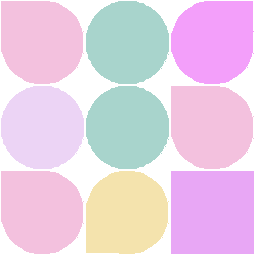

<h1 align="center">
    
</h1>

<div align="center">
    <h2>FakeImage - generates images for your factories</h2>
    <p>Local generation of placeholder images</p>
</div>
<br/>
<br/>

# Install

Add to your composer.json

```json
{
  "repositories": [
    {
      "type": "vcs",
      "url": "https://github.com/melervand/fake-image"
    }
  ],
  "require": {
    "melervand/fake-image": "dev-master"
  }
}
```

Then install with Composer

```sh
composer update melervand/fake-image
```

# Usage

You can use predefined Facades:

```php
Placeholder::withSize(256, 128)
           ->saveAsFile('./placeholder.png');
//or
GeometricPattern::withSize(256, 256)
                ->saveAsFile('./pattern.png');
```

Or use underlying classes:

```php
$width = 256;
$height = 128;
$text = Text::withString("{$width}x{$height}", Color::withHEX('fff'));

Image::withSize($width, $height)
     ->setFillColor(Color::withHEX('ccc'))
     ->add(
         $text,
         Coordinate::withXY(($width - $text->getWidth()) / 2, ($height - $text->getHeight()) / 2)
     )
     ->saveAsFile('./image.png');

//same result as from Placeholder::withSize(256, 128)
```

Examine source code for more figures

# Roadmap

- [ ] crop support
- [ ] layer substraction
- [ ] TTF font support

# License

This project is licensed under the MIT license. Feel free to edit and distribute this package as you like.

See [LICENSE](LICENSE) for more information.
